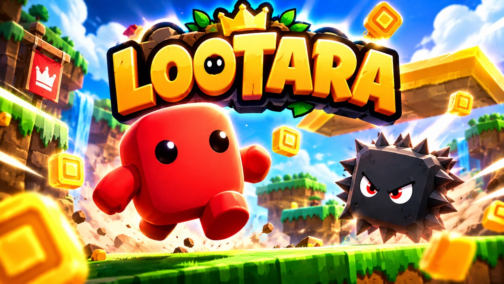
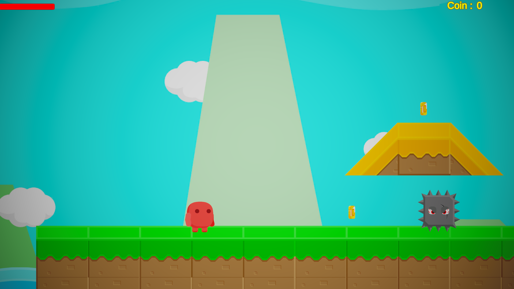
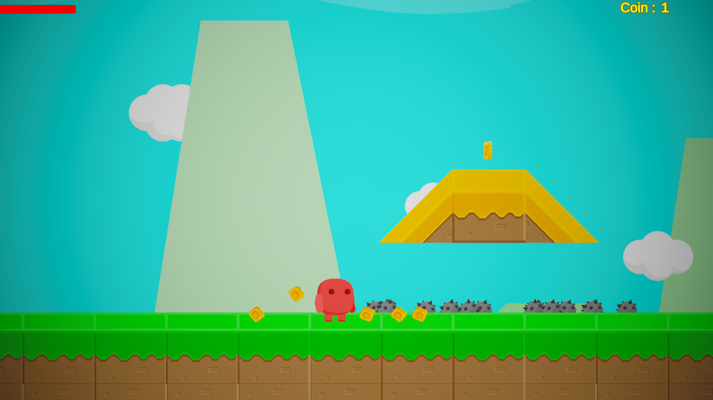
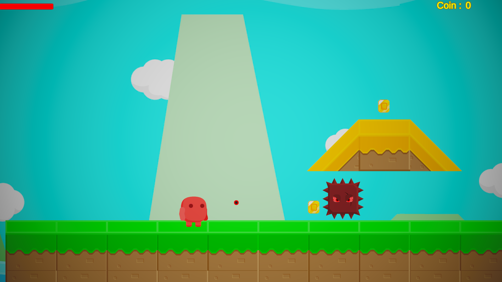
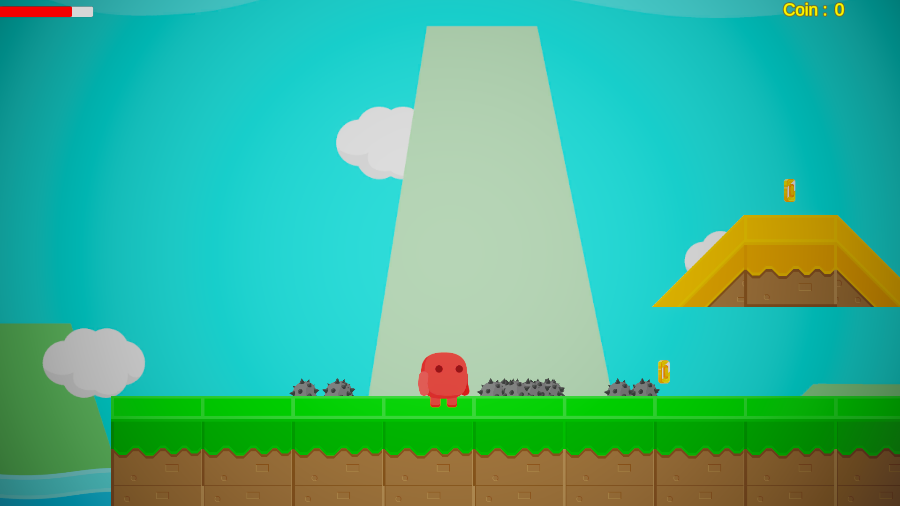
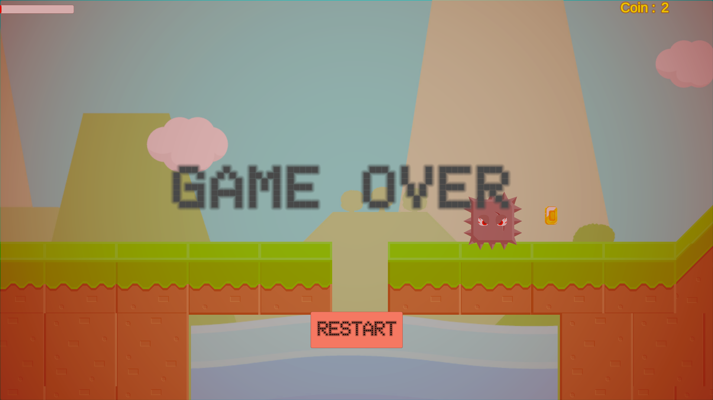

# 🪙 Lootara

<p align="center">
  
</p>

[](https://unity.com/)
[](https://play.unity.com)
[](LICENSE)

A 2D platformer built with **Unity 6**. Run and jump across the level, collect coins, shoot the spiky enemies that patrol the platforms and stay away from the water!

🎮 **[Play the Game in Your Browser (Unity Play)](https://play.unity.com/en/games/42804fe8-5650-4832-a48c-b7aadaab46de/lootara)**

---

## 📸 Screenshots

*In-game screenshots:*

| Gameplay | Coin Pickup | Enemy Hit |
| :---: | :---: | :---: |
|  |  |  |

| Enemy Death | Game Over |
| :---: | :---: |
|  |  |

---

## ✨ Features

- **Platformer Movement:** Run left and right and jump with Rigidbody2D physics.
- **Shooting:** Fire arcing bullets in the direction the character is facing. Each bullet deals 25 damage and disappears after 3 seconds.
- **Patrolling Enemies:** Enemies walk back and forth between patrol points. Touching one costs 25 health and knocks the player back.
- **Health System:** The player starts with 100 health, shown on a health bar. Enemies take 4 hits to destroy.
- **Water Hazard:** Falling into the water is instant death (100 damage).
- **Collectibles:** Collect coins to raise your score, shown on the HUD.
- **Particle Effects:** Particle bursts on coin pickup and enemy death.
- **Game Over Screen:** Restart the level after dying.
- **Audio System:** Background music and sound effects for jumping, shooting, hits, coins, explosions and water splashes, handled through a central SoundManager with a `SoundType` enum.
- **Interface-Based Damage:** The player and enemies share an `IDamageable` interface, so bullets, enemies and water can damage any target.
- **Animator Driven:** Movement, jump and hit animations are controlled with Animator parameters.
- **WebGL Build:** Playable directly in the browser via Unity Play.

---

## 🕹️ Controls

| Action | Input |
| ------ | ----- |
| **Move Left / Right** | `A` / `D` or `Left` / `Right` Arrow Keys |
| **Jump** | `Spacebar` |
| **Shoot** | Left mouse button |

---

## 🧩 Scripts

| Script | Purpose |
| ------ | ------- |
| `CharacterController` | Player movement, jump, shooting, knockback and health |
| `EnemyController` | Patrol movement, damage handling, particle effect on death |
| `Bullet` | Projectile movement and damage |
| `Coin` | Collectible pickup, particle effect and sound |
| `Water` | Instant-death hazard |
| `IDamageable` | Shared damage interface |
| `UIManager` / `HealthUI` / `CoinUI` / `GameOverUI` | Health bar, coin counter and game over panel |
| `SoundManager` | Music and sound effects |

---

## 🛠️ Tech Stack & Assets

- **Engine:** Unity 6.3 LTS (6000.3.13f1)
- **Language:** C#
- **Input:** Legacy Input Manager
- **Physics:** Rigidbody2D and 2D colliders
- **Assets & Packages:**
  * Platform art: [Free Platform Game Assets](https://assetstore.unity.com/packages/2d/environments/free-platform-game-assets-85838)
  * Sound effects: [8 Bits Elements](https://assetstore.unity.com/packages/audio/sound-fx/8-bits-elements-16848)
  * Music: [8-Bit RPG Adventure Music Pack](https://assetstore.unity.com/packages/audio/music/electronic/8-bit-rpg-adventure-music-pack-184726)

---

## 🚀 Getting Started (Local Setup)

1. **Clone the repository:**
```
   git clone https://github.com/emirsumer/Lootara.git
```
2. **Open with Unity:** Add the folder in Unity Hub and use Unity 6000.3.13f1 (or a compatible Unity 6 version).
3. **Run the Game:** Open the `SampleScene` scene and press **Play**.

---

## 🙏 Credits

- The core gameplay was developed together with my instructor. I added the water hazard and the game over screen and continued developing the game on my own.
- Art, sound effects and music from the Unity Asset Store.
- Cover art: AI-generated.

## 📜 License

This project is open-source and available under the MIT License.
